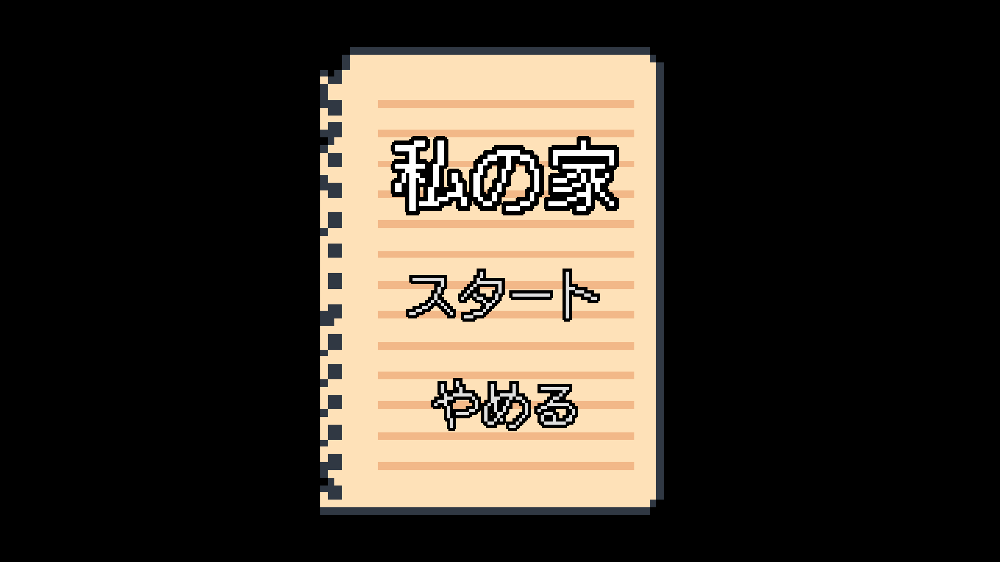
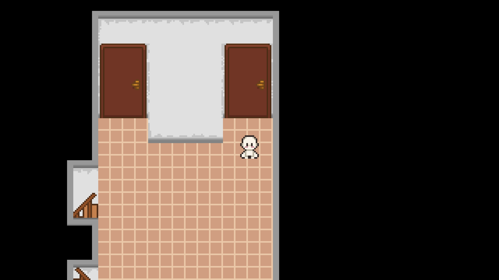
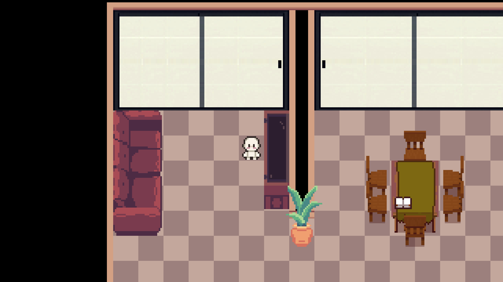

# Watashi no ie (私の家)

Small "game" for my Japanese A1 class.

There is not much gameplay. It mainly models an apartment (マンション) as a way to give a tour and guide a person through the house, while indicating the name of each room, object, and the position of each object.

## Screenshots

